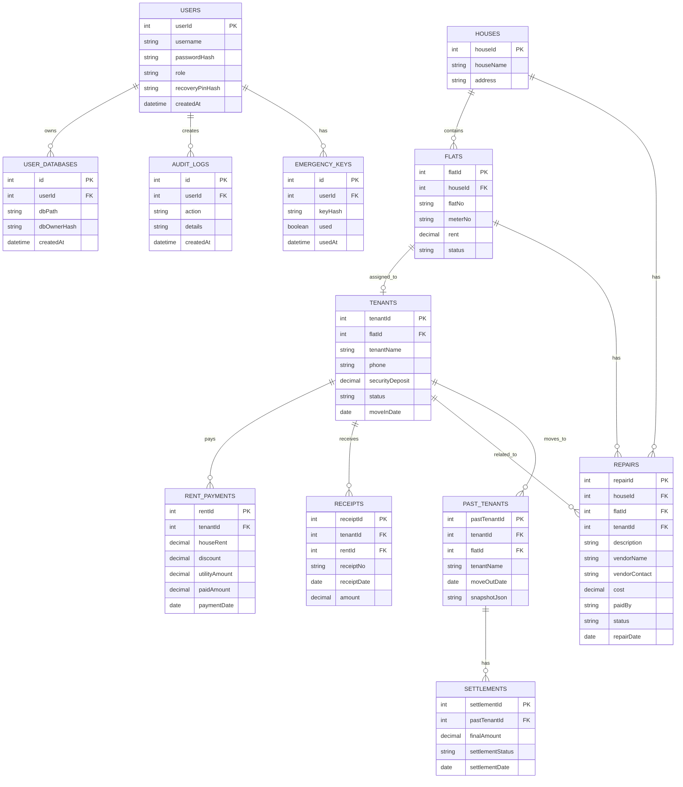
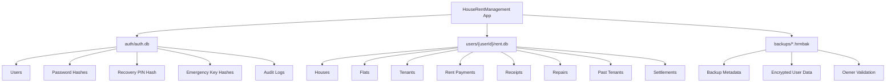

# House Rent Management System v2.0

A secure JavaFX + SQLite desktop application for managing houses, flats, tenants, rent collection, receipts, repairs, reports, backups, and user-based encrypted data.

> **Version:** HouseRentManagement v2.0  
> **Platform:** Windows desktop app  
> **Technology:** JavaFX, SQLite, JDBC, iText/OpenPDF-style PDF export, Apache POI-style Excel export  
> **Main launcher class:** `com.houserent.Launcher`

---

## Table of Contents

- [Overview](#overview)
- [What’s New in v2.0](#whats-new-in-v20)
- [Secure Multi-User Database Design](#secure-multi-user-database-design)
- [v1.0 Upgrade Notice](#v10-upgrade-notice)
- [Default Login](#default-login)
- [Core Features](#core-features)
- [Accounting Rules](#accounting-rules)
- [Tenant Lifecycle](#tenant-lifecycle)
- [Receipts](#receipts)
- [Repair Management](#repair-management)
- [Reports and Export](#reports-and-export)
- [Security and User Management](#security-and-user-management)
- [Recovery System](#recovery-system)
- [Backup and Restore](#backup-and-restore)
- [Factory Reset](#factory-reset)
- [Audit Logs](#audit-logs)
- [Migration Flow](#migration-flow)
- [Application Data Locations](#application-data-locations)
- [Installer and Packaging](#installer-and-packaging)
- [Release Checklist](#release-checklist)
- [Known Design Decisions](#known-design-decisions)
- [Future Improvements](#future-improvements)
- [Database ER Diagram](#database-er-diagram)
- [High-Level Database/File Layout](#high-level-databasefile-layout)
- [License](#license)

---

## Overview

**House Rent Management System** is a desktop rent-management application designed for landlords, property managers, and small rental businesses. It manages houses, flats, tenants, rent payments, monthly dues, utility records, repair expenses, receipts, reports, backups, and secure recovery.

The v2.0 release focuses heavily on:

- secure multi-user login,
- per-user encrypted databases,
- safe backup/restore rules,
- recovery without a developer master key,
- tenant lifecycle tracking,
- repair and expense management,
- reporting and export features,
- improved JavaFX UI behavior,
- installer-ready packaging.

---

## What’s New in v2.0

HouseRentManagement v2.0 introduces major security, database, accounting, and lifecycle improvements over v1.0.

### Major Changes

- Secure multi-user authentication system.
- Separate authentication database and per-user encrypted rent databases.
- Migration flow from legacy v1.0 database after Admin login.
- Recovery PIN support.
- Locally generated one-time emergency recovery keys.
- Backup and restore using `.hrmbak` files.
- Cross-user restore blocking.
- Factory reset behavior that recreates a fresh database with a default admin.
- Tenant Move Out lifecycle with settlement snapshot.
- Past Tenants settlement popup flow.
- End-to-end repair management.
- PDF export, Excel export, print, and date-range reports.
- Meter number support for flats.
- Improved JavaFX UI behavior and popup stage icons.

---

## Secure Multi-User Database Design

v2.0 separates authentication data from each user’s business/rent data.

### Database Layout

```text
AppData/Roaming/HouseRentManagement/
├── auth/
│   └── auth.db
├── users/
│   └── {userId}/
│       └── rent.db
└── backups/
    └── *.hrmbak
```

### Authentication Database

The authentication database is stored separately:

```text
AppData/Roaming/HouseRentManagement/auth/auth.db
```

It stores user login and security-related information such as:

- users,
- password hashes,
- recovery PIN data,
- hashed emergency recovery keys,
- user database ownership metadata,
- audit information.

### Per-User Rent Databases

Each user has a separate encrypted rent database:

```text
AppData/Roaming/HouseRentManagement/users/{userId}/rent.db
```

This design prevents one user from directly mixing or overwriting another user’s rental data.

---

## v1.0 Upgrade Notice

If you are upgrading from **HouseRentManagement v1.0**, the legacy database may exist at:

```text
AppData/Roaming/HouseRentManagement/database/rent.db
```

### Important Upgrade Rule

Before installing v2.0, v1.0 may need to be manually uninstalled.

> **Do not delete AppData during uninstall.**

The v2.0 migration flow depends on the legacy AppData database remaining available.

### Recommended Upgrade Flow

1. Close HouseRentManagement v1.0.
2. Uninstall v1.0 if required.
3. Do **not** delete AppData.
4. Install HouseRentManagement v2.0.
5. Login as Admin.
6. Run the migration flow when prompted.
7. Verify migrated houses, flats, tenants, rents, receipts, repairs, and reports.
8. Create a fresh v2.0 backup.

---

## Default Login

After a fresh installation or factory reset, the default admin account is:

```text
Username: admin
Password: 1234
```

> Change the default password after first login for better security.

---

## Core Features

### House Management

- Add, edit, delete, and view house records.
- Track house-level information.
- Use houses as parent records for flats.

### Flat Management

- Add, edit, delete, and view flats.
- Assign flats to houses.
- Track flat status.
- Track fixed monthly rent.
- Track meter number using the `meterNo` field.
- Free a flat when a tenant moves out.

### Tenant Management

- Add, edit, delete, and view tenants.
- Assign tenants to available flats.
- Rent is loaded from the selected flat and is not manually edited while adding tenants.
- Optional security deposit support.
- Track tenant status such as Active or Moved Out.
- Move tenants to Past Tenants through lifecycle actions.

### Rent Management

- Record monthly rent collections.
- Track discount separately.
- Calculate rent income using accounting rules.
- Track due rent.
- Keep utilities separate from base rent.

### Utility Tracking

- Track utility charges separately from rent.
- Keep utility records independent from rent income calculations.

### Repair Management

- Add, edit, delete, and view repairs.
- Track repair type/details.
- Track repair vendor.
- Track repair contact number.
- Track paid-by information.
- Track repair status.
- Filter repairs by paid-by, status, date, and search keyword.

### Reporting

- Income reports.
- Due reports.
- Flat summaries.
- Tenant summaries.
- Grouped reports.
- Date-range filtering.
- PDF export.
- Excel export.
- Print support.

---

## Accounting Rules

The application follows these accounting rules consistently across rent, reports, and summaries.

### Rent Amount

Rent is fixed from the `flats` table.

When adding a tenant, rent is selected from the assigned flat and should not be manually edited in the tenant form.

### Security Deposit

Security deposit is optional.

Security deposit is **not counted as income**.

### Rent Income

Rent income is calculated as:

```text
rent income = house_rent - discount
```

### Utilities

Utilities are tracked separately.

Utility charges should not be mixed with base rent income unless a report explicitly includes utilities as a separate category.

### Repairs

Repair accounting depends on who paid the repair cost.

```text
Owner-paid repair  → reduces net profit
Tenant-paid repair → does not reduce owner net profit
```

Repair costs must never be counted as rent due.

---

## Tenant Lifecycle

Tenant Move Out is a lifecycle-only action.

When a tenant moves out, the system should:

1. Mark the tenant as `Moved Out`.
2. Free the assigned flat.
3. Save a settlement snapshot.
4. Move the tenant to Past Tenants history.

Actual settlement or payment handling is done later from:

```text
Past Tenants > Settlement Popup
```

This keeps move-out status changes separate from final settlement transactions.

---

## Receipts

The system supports receipt handling for rent-related records.

Receipts are intended to support:

- rent payment confirmation,
- tenant payment history,
- printable records,
- PDF export,
- future receipt enhancements.

Receipt records should follow the accounting rules defined above:

- rent income excludes security deposit,
- discount reduces rent income,
- utilities remain separate,
- repair costs are not rent due.

---

## Repair Management

Repair management is end-to-end in v2.0.

### Repair Fields

Repair records may include:

- repair ID,
- house or flat reference,
- tenant reference if applicable,
- repair description,
- vendor name,
- vendor/contact number,
- repair cost,
- paid by,
- repair status,
- repair date,
- notes.

### Repair Filters

Repair view supports filtering by:

- paid by,
- status,
- date,
- search keyword.

### Repair Accounting

Owner-paid repairs reduce net profit.

Tenant-paid repairs do not reduce owner net profit.

Repair costs must never appear as rent due.

---

## Reports and Export

The reporting module includes summary and grouped reporting features.

### Supported Reports

- Income report.
- Due report.
- Flat report.
- Tenant report.
- Grouped reports.
- Date-range reports.

### Export and Print

Reports support:

- PDF export,
- Excel export,
- print.

### Date Range Filtering

Reports should allow filtering by date range where applicable, especially for:

- rent collections,
- income summaries,
- due summaries,
- repairs,
- profit summaries.

### Future Extensibility

The reporting module is designed for future expansion such as:

- dashboard charts,
- yearly summaries,
- owner-wise reports,
- property-wise profit/loss reports,
- tenant payment history exports.

---

## Security and User Management

v2.0 includes a secure login and user-management model.

### Save Login

The Save Login checkbox controls auto-login behavior.

- If Save Login is enabled, login can be remembered.
- Logout clears the saved login.

### Database Ownership

The installed application owns and manages its database files.

Live data must be stored in a user-writable AppData location and never inside Program Files.

### No Developer Master Key

There is no developer master key.

Recovery is handled locally through approved recovery options only.

---

## Recovery System

The recovery system is designed to protect user data while avoiding a developer-controlled backdoor.

### Recovery Methods

Pre-login recovery mode allows only approved recovery actions:

- Recovery PIN.
- One-time emergency recovery key.
- Restore backup.
- Factory reset.

### Recovery PIN

Recovery PIN allows account recovery while preserving user data.

### Emergency Recovery Keys

The application generates 10 local one-time emergency recovery keys.

Emergency keys are:

- generated locally,
- stored as hashes,
- usable one time only,
- invalidated after use,
- available for PDF save or print.

Users should store emergency keys safely outside the application.

---

## Backup and Restore

Backups use the `.hrmbak` extension.

### Backup Rules

- Backup requires login.
- Backup should include enough metadata to verify ownership.
- Backup files should be stored safely by the user.

### Restore Rules

Restore can be available from recovery mode or authenticated mode depending on the flow.

The restore system must block cross-user restore when the backup does not belong to the current user or permitted recovery context.

### Backup Extension

```text
*.hrmbak
```

---

## Factory Reset

Factory reset is a destructive recovery option.

Factory reset deletes the active rent database and recreates a fresh database with the default admin account.

After factory reset, the default login is restored:

```text
Username: admin
Password: 1234
```

Factory reset should be used only when recovery PIN, emergency keys, and backup restore are not available or not desired.

---

## Audit Logs

Audit logs are included as part of the v2.0 security and accountability plan.

Audit logs may be used to track important events such as:

- login,
- logout,
- failed login,
- password or recovery changes,
- backup creation,
- restore attempt,
- restore success/failure,
- factory reset,
- migration,
- user management actions.

---

## Migration Flow

Migration is intended for users upgrading from v1.0.

### Legacy v1.0 Path

```text
AppData/Roaming/HouseRentManagement/database/rent.db
```

### v2.0 Path

```text
AppData/Roaming/HouseRentManagement/users/{userId}/rent.db
```

### Migration Flow After Admin Login

1. User installs v2.0.
2. User logs in as Admin.
3. Application checks for legacy v1.0 database.
4. Application prompts for migration if legacy data exists.
5. Application migrates data into the Admin/user database.
6. Application verifies migrated records.
7. User creates a fresh `.hrmbak` backup.

---

## Application Data Locations

Live application data must be stored under AppData, not Program Files.

### Legacy v1.0 Database

```text
AppData/Roaming/HouseRentManagement/database/rent.db
```

### v2.0 Authentication Database

```text
AppData/Roaming/HouseRentManagement/auth/auth.db
```

### v2.0 Per-User Database

```text
AppData/Roaming/HouseRentManagement/users/{userId}/rent.db
```

---

## Installer and Packaging

The application is packaged as a Windows desktop application.

### Main Class

```text
com.houserent.Launcher
```

### Packaging Requirements

The `dist/input` folder should include the required runtime dependencies, application JAR, libraries, license file, and other resources needed by the installer.

### License File

Include:

```text
LICENSE
```

### jpackage Command Example

Use a fixed upgrade UUID so future installers can upgrade the same app line consistently.

```bash
jpackage \
  --type exe \
  --name "House Rent Management System" \
  --app-version "2.0.0" \
  --vendor "HouseRentManagement" \
  --input dist/input \
  --main-jar HouseRentManagement.jar \
  --main-class com.houserent.Launcher \
  --dest dist/installer \
  --win-dir-chooser \
  --win-menu \
  --win-shortcut \
  --win-upgrade-uuid 6f2a37f8-6e9f-4c1e-a2f7-9f18f7c6b431 \
  --license-file LICENSE
```

> Keep the `--win-upgrade-uuid` unchanged for v2.x upgrades.

---

## Release Checklist

Use this checklist before publishing v2.0.

### Database and Migration

- [ ] Fresh install creates `auth/auth.db`.
- [ ] Fresh install creates per-user `users/{userId}/rent.db`.
- [ ] Legacy v1.0 database path is detected correctly.
- [ ] Migration runs after Admin login.
- [ ] Migration does not delete legacy data automatically.
- [ ] Migrated houses, flats, tenants, rents, receipts, repairs, and reports are verified.

### Authentication and Recovery

- [ ] Default admin login works.
- [ ] Password change works.
- [ ] Save Login checkbox works.
- [ ] Logout clears saved login.
- [ ] Recovery PIN works.
- [ ] Emergency keys are generated locally.
- [ ] Emergency keys are stored hashed.
- [ ] Emergency keys become invalid after use.
- [ ] Emergency key PDF save/print works.
- [ ] No developer master key exists.

### Backup and Restore

- [ ] Backup requires login.
- [ ] `.hrmbak` backup is created successfully.
- [ ] Restore works for valid owner/user.
- [ ] Cross-user restore is blocked.
- [ ] Restore failure does not corrupt current data.

### Factory Reset

- [ ] Factory reset deletes active rent database.
- [ ] Factory reset recreates a fresh database.
- [ ] Default admin is recreated.
- [ ] Factory reset warning is clear.

### House, Flat, Tenant

- [ ] House CRUD works.
- [ ] Flat CRUD works.
- [ ] `meterNo` appears in DAO, controllers, and views.
- [ ] Tenant CRUD works.
- [ ] Tenant rent is loaded from flat rent.
- [ ] Tenant rent is non-editable while adding tenant.
- [ ] Security deposit is optional.
- [ ] Tenant Move Out marks tenant as Moved Out.
- [ ] Tenant Move Out frees the flat.
- [ ] Settlement snapshot is saved.

### Rent, Repairs, Reports

- [ ] Rent income calculation follows `house_rent - discount`.
- [ ] Security deposit is not counted as income.
- [ ] Utilities are separate.
- [ ] Owner-paid repairs reduce net profit.
- [ ] Tenant-paid repairs do not reduce net profit.
- [ ] Repair costs never count as rent due.
- [ ] Repair filters work by paid-by, status, date, and search.
- [ ] Vendor/contact fields work.
- [ ] Income report works.
- [ ] Due report works.
- [ ] Flat summary works.
- [ ] Tenant summary works.
- [ ] Grouped reports work.
- [ ] Date-range filtering works.
- [ ] PDF export works.
- [ ] Excel export works.
- [ ] Print works.

### UI/UX

- [ ] GridPane rowIndex overlap issues are fixed.
- [ ] TableView columnResizePolicy is set in controllers.
- [ ] Stage icons appear on all popups.
- [ ] Status color badges are implemented or tracked as remaining work.

### Installer

- [ ] `dist/input` contains all required dependencies.
- [ ] `LICENSE` is included.
- [ ] Launcher main class is correct.
- [ ] Installer uses `--win-dir-chooser`.
- [ ] Installer uses `--win-menu`.
- [ ] Installer uses `--win-shortcut`.
- [ ] Installer uses fixed upgrade UUID.
- [ ] v1.0 manual uninstall note is included in release notes.

---

## Known Design Decisions

- Rent is fixed from the `flats` table.
- Rent is not editable while adding tenants.
- Security deposit is optional.
- Security deposit is not counted as income.
- Rent income equals `house_rent - discount`.
- Utilities are tracked separately.
- Owner-paid repairs reduce net profit.
- Tenant-paid repairs do not reduce owner net profit.
- Repair costs are never counted as rent due.
- Tenant Move Out is lifecycle-only.
- Actual settlement/payment is handled later from Past Tenants settlement popup.
- Live data is stored in AppData, not Program Files.
- v2.0 uses separate auth and per-user encrypted rent databases.
- Recovery does not use a developer master key.
- Emergency keys are local, one-time, and stored hashed.
- v1.0 may require manual uninstall without deleting AppData before installing v2.0.

---

## Future Improvements

Planned or possible future improvements:

- Status color badges across tables and forms.
- Dashboard charts.
- Advanced yearly and monthly analytics.
- SMS/email receipt sending.
- Cloud backup option.
- More detailed role permissions.
- Multi-property owner support.
- Import/export templates.
- More advanced audit log viewer.
- Automated database health check.
- Dark mode.

---

## Database ER Diagram



---

## High-Level Database/File Layout



---

## License

This project should include a `LICENSE` file in the release package.

If no license has been selected yet, add one before public distribution.

Recommended options:

- MIT License for simple open-source distribution.
- Proprietary license for private/commercial distribution.

---

## Final Notes

House Rent Management System v2.0 is designed to be safer, more structured, and more maintainable than v1.0. The main goals are accurate rent accounting, clear tenant lifecycle management, secure user-based data separation, reliable recovery, and installer-ready deployment.
