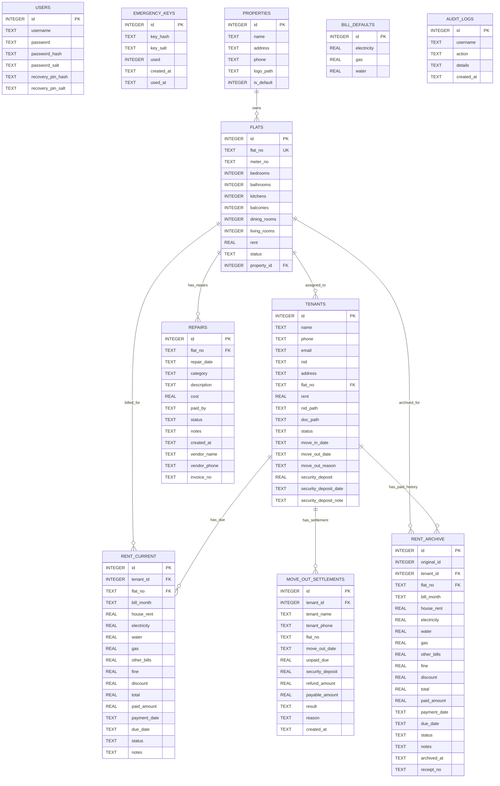

# House Rent Management System

An offline JavaFX desktop application for managing flats, tenants, rent billing, rent receipts, repairs, reports, backups, recovery, audit logs, and tenant move-out settlements.

> Built for local/offline use with JavaFX and SQLite.

---

## Table of Contents

- [Overview](#overview)
- [Core Features](#core-features)
- [Accounting Rules](#accounting-rules)
- [Tenant Lifecycle](#tenant-lifecycle)
- [Receipt System](#receipt-system)
- [Repair & Maintenance](#repair--maintenance)
- [Reports](#reports)
- [Security & Recovery](#security--recovery)
- [Audit Logs](#audit-logs)
- [Database Schema](#database-schema)
- [ER Diagram](#er-diagram)
- [Project Structure](#project-structure)
- [Setup & Run](#setup--run)
- [Default Login](#default-login)
- [Release Checklist](#release-checklist)
- [Known Design Decisions](#known-design-decisions)

---

## Overview

House Rent Management System is a local desktop application designed to help a property owner manage:

- Flats and property information
- Active and past tenants
- Monthly rent generation
- Rent payment and archive records
- Receipt PDF generation with receipt numbers
- Repair and maintenance records
- Owner-paid vs tenant-paid repair tracking
- Income, due, utility, repair, and net profit reports
- Move-out settlement preview and settlement PDF
- Backup, restore, factory reset, and account recovery
- Audit logs for sensitive actions

The application stores data locally in SQLite and is intended for offline use.

---

## Core Features

### Tenant Management

- Add tenants with flat assignment.
- Edit tenant profile.
- View tenant details.
- Validate tenant mobile number, email, and NID.
- Track optional security deposit.
- Move tenants out without deleting history.
- View moved-out tenants in Past Tenants.
- Delete mistaken tenants when appropriate.

### Flat Management

- Add, edit, and delete flats.
- Track flat number and meter number.
- Track room details such as bedrooms, bathrooms, kitchens, balconies, dining rooms, and living rooms.
- Track flat rent and occupancy status.
- Mark flats available or occupied based on tenant lifecycle.

### Rent Management

- Generate monthly rent rows for active tenants.
- Fixed house rent comes from the flats table.
- Supports electricity, water, gas, other bills, fine, and discount.
- Supports due, partial, late, and paid statuses.
- Paid rent rows move to rent archive.
- Archived payments can be restored to due or deleted if created by mistake.

### Receipt Management

- Receipt PDF export.
- Receipt number stored with archived payment.
- Immediate payment receipt and archive reprint use the same receipt number.
- Archive reprint uses original payment date.
- Receipt can include property name and address.
- Receipt includes meter number and payment details.

### Repair & Maintenance

- Add, edit, and delete repair records.
- Track repair date, flat, category, description, cost, paid by, status, and notes.
- Track vendor name, vendor phone, and invoice number.
- Owner-paid repair reduces net profit.
- Tenant-paid repair does not reduce net profit.

### Reports

- Income report.
- Due rent report.
- Flat-wise income report.
- Tenant-wise report.
- Monthly and yearly income reports.
- Repair report.
- Utility bills report.
- PDF export.
- Excel export.
- Print support.
- Date and month filtering.

### Dashboard

- Summary cards for flats, tenants, income, due, utility bills, repairs, and net profit.
- Recent payment rows.
- Recent due rows.
- Recent repairs.
- Charts for income, due, occupancy, and repair comparison.

---

## Accounting Rules

The system separates rent income, utility bills, repairs, security deposit, and settlement values.

### Rent Income

Rent income is calculated as:

```text
Rent Income = house_rent - discount
```

Discount reduces rent income.

### Utility Bills

Utility bills are tracked separately:

```text
Utility Bills = electricity + water + gas + other_bills
```

Utility bills are not counted as rent income.

### Repairs

Owner-paid repairs reduce net profit:

```text
Net Profit = Rent Income - Owner Paid Repairs
```

Tenant-paid repairs are tracked but do not reduce owner net profit.

### Security Deposit

Security deposit is optional and is not counted as income.

```text
Security Deposit = held money / liability
```

If no deposit is taken:

```text
security_deposit = 0
security_deposit_date = null
security_deposit_note = null
```

### Refunds

Refunds are settlement/cash-flow information, not rent income reduction.

### Discount / Waiver

If rent is settled for less than the original house rent, the waived amount should be recorded as discount.

---

## Tenant Lifecycle

### Active Tenant

An active tenant is assigned to an occupied flat and can have current rent rows.

### Move Out

Move Out is a lifecycle action, not a payment action.

Move Out does:

- Mark tenant as `Moved Out`.
- Save move-out date.
- Save move-out reason.
- Mark flat as available.
- Save a settlement snapshot.
- Keep due rows unchanged if rent is still unpaid.

Move Out does not:

- Mark rent as paid.
- Move rent to archive.
- Apply discount.
- Delete rent records.

### Past Tenants

Moved-out tenants appear in Past Tenants.

Past Tenants supports:

- View tenant details.
- View settlement details.
- Print settlement PDF.
- Delete if safe according to cleanup rules.

### Mistaken Tenant Cleanup

If a tenant was added by mistake:

- If only current due rows exist, the tenant can be deleted with current due rows.
- If archive/payment history exists, delete the mistaken archive payment first, then delete the tenant.

---

## Receipt System

Receipt numbers are stored in `rent_archive.receipt_no`.

Recommended format:

```text
RCP-YYYY-000001
```

Receipt behavior:

- Receipt number is generated when rent moves to archive.
- Immediate payment receipt fetches archived row and prints stored receipt number.
- Archive reprint prints the same receipt number.
- Archive reprint uses original payment date, not today’s date.
- Deleted mistaken archive payments reduce income/report totals naturally.

---

## Repair & Maintenance

Repair records include:

- Flat number
- Repair date
- Category
- Description
- Cost
- Paid by: Owner or Tenant
- Status: Pending or Completed
- Notes
- Vendor name
- Vendor phone
- Invoice number

Repair logic:

```text
Owner-paid repair -> reduces net profit
Tenant-paid repair -> tracked separately, does not reduce net profit
```

---

## Reports

Reports support:

- Income summary
- Due summary
- Utility bills summary
- Repair summary
- Net profit summary
- Monthly income
- Yearly income
- Flat-wise income
- Tenant-wise income
- Repair report
- Utility report
- PDF export
- Excel export
- Printing

Important report rules:

```text
Rent Income = house_rent - discount
Utility Bills = electricity + water + gas + other_bills
Net Profit = Rent Income - Owner Paid Repairs
Security Deposit = not income
Refund = not income
```

---

## Security & Recovery

### Login

- Login required unless user explicitly chooses Save Login.
- Save Login can auto-open dashboard on next app start.
- Logout clears saved login.

### Password Security

- Supports password hashing and salt migration from older plain password data.

### Recovery PIN

- Recovery PIN can be set and used for password recovery.

### Emergency Recovery Keys

- Generates local one-time emergency recovery keys.
- Keys are stored hashed.
- Used keys are invalidated.
- No developer master key exists.

### Backup / Restore

- Database backup requires login.
- Restore backup is available through recovery flow.

### Factory Reset

Factory reset deletes the current database and recreates a fresh database with default admin user.

---

## Audit Logs

Audit logs track important business and security actions.

Examples:

- Login success / failed
- Logout
- Database backup
- Database restore
- Factory reset
- Password changed
- Recovery PIN set
- Emergency keys generated
- Emergency key used
- Rent payment
- Receipt printed
- Archive restored
- Archive payment deleted
- Tenant added / updated / deleted / moved out
- Flat added / updated / deleted
- Property added / updated / deleted
- Repair added / updated / deleted
- Report exported / printed
- Settlement created / settled / PDF exported

Audit retention policy:

```text
Keep audit logs for 365 days.
No manual clear button.
Automatic cleanup after new log insert.
```

---

## Database Schema

Main SQLite database path during development:

```text
src/main/resources/database/rent.db
```

> For release, it is recommended to move runtime data outside `src/main/resources`, for example into an application data folder.

### Main Tables

| Table | Purpose |
|---|---|
| `users` | Login users, password hash/salt, recovery PIN hash/salt |
| `emergency_keys` | One-time emergency recovery keys |
| `properties` | Property name, address, phone, logo, default flag |
| `flats` | Flat details, meter number, rent, occupancy, property link |
| `tenants` | Tenant profile, status, move-out info, security deposit |
| `bill_defaults` | Global default utility bill values |
| `rent_current` | Current unpaid/due/partial/late rent rows |
| `rent_archive` | Paid/archived rent rows and receipt numbers |
| `repairs` | Repair and maintenance records with vendor details |
| `audit_logs` | App activity and security events |
| `move_out_settlements` | Move-out settlement snapshot records |

---

## ER Diagram



---

## Project Structure

Recommended structure:

```text
src/main/java/com/rent/
├── controller/
│   ├── LoginController.java
│   ├── DashboardController.java
│   ├── TenantController.java
│   ├── RentController.java
│   ├── ArchiveController.java
│   ├── RepairController.java
│   ├── ReportsController.java
│   └── ...
├── dao/
│   ├── TenantDAO.java
│   ├── FlatDAO.java
│   ├── RentDAO.java
│   ├── RepairDAO.java
│   ├── ReportDAO.java
│   ├── DashboardDAO.java
│   └── ...
├── model/
│   ├── Tenant.java
│   ├── Flat.java
│   ├── RentRow.java
│   ├── Repair.java
│   ├── ReportRow.java
│   └── ...
├── util/
│   ├── DBUtil.java
│   ├── AuditActions.java
│   ├── StatusBadgeCellFactory.java
│   └── ...
└── main/
    └── Main.java

src/main/resources/
├── fxml/
│   ├── pages/
│   └── ...
├── css/
├── images/
└── database/
```

---

## Setup & Run

### Requirements

- Java 17 or later recommended
- JavaFX SDK
- SQLite JDBC
- Apache PDFBox
- Apache POI for Excel export
- Maven project structure recommended

### Run from IntelliJ IDEA

1. Open the project in IntelliJ IDEA.
2. Make sure JavaFX SDK is configured.
3. Make sure Maven dependencies are loaded.
4. Run `com.rent.main.Main`.

### Database Initialization

On app start:

- Database tables are created if missing.
- Missing columns are added through safe migrations.
- Default admin user is inserted if missing.

---

## Default Login

Default user after fresh database creation:

```text
Username: admin
Password: 1234
```

Change the default password after first login.

---

## Release Checklist

Before release, verify:

- [ ] Login works.
- [ ] Save Login checkbox works.
- [ ] Logout clears saved login.
- [ ] Add/edit/delete flat works.
- [ ] Add/edit tenant works.
- [ ] Tenant validation works for mobile, email, and NID.
- [ ] Move Out works.
- [ ] Past Tenants works.
- [ ] Rent generation creates rows only for active tenants.
- [ ] Payment moves rent to archive.
- [ ] Receipt number appears on immediate receipt and archive reprint.
- [ ] Archive Restore works.
- [ ] Archive Delete works for mistaken payment cleanup.
- [ ] Discount reduces income.
- [ ] Utility bills are separate from income.
- [ ] Security deposit is not counted as income.
- [ ] Repair vendor/contact/invoice fields save and reload.
- [ ] Status badges display correctly.
- [ ] Reports export PDF.
- [ ] Reports export Excel.
- [ ] Settlement PDF exports.
- [ ] Backup works.
- [ ] Restore works.
- [ ] Factory reset works.
- [ ] Audit logs record important actions.
- [ ] Emergency recovery keys generate and validate.

---

## Known Design Decisions

### Move Out vs Delete

```text
Move Out = real tenant leaves, history preserved.
Delete = mistake cleanup.
```

### Archive Restore vs Archive Delete

```text
Restore = payment was marked paid by mistake, but rent is still due.
Delete = archive/payment record was created by mistake and should not exist.
```

### Security Deposit

```text
Security deposit is optional and not income.
```

### Settlement

```text
Move Out saves a settlement snapshot.
Settlement can be reviewed and printed from Past Tenants.
```

### Repairs

```text
Owner-paid repairs reduce net profit.
Tenant-paid repairs are tracked separately.
```

---

## Suggested Future Improvements

Only if needed after release:

- Move runtime database outside `src/main/resources`.
- Add app installer packaging.
- Add print preview.
- Add cash-flow ledger for deposit/refund tracking.
- Add repair invoice attachment upload.
- Add multi-row move-out settlement automation.

---

## License

This project is intended for private/offline property management use. Add a formal license if you plan to distribute it publicly.
